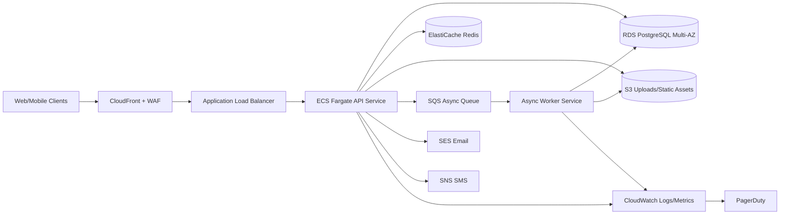

# Silverleaf System Design (POC -> Production)

## 1) Goals and Constraints
- Product scope: gated community app with onboarding, resident management, and social feed.
- Near-term goal: finish web/product flow locally, then push to AWS with safe rollout.
- Non-functional targets (initial):
  - API p95 latency: `< 300 ms` for common reads.
  - Availability: `99.9%` (single region, multi-AZ DB).
  - Cost-aware: start lean in `dev/qa`, scale in `prod`.

## 2) Core System Diagram

## 3) Main Dataflow
1. Client sends API request through `CloudFront/WAF -> ALB`.
2. ALB routes to ECS API task.
3. API:
   - Reads/writes canonical data in RDS.
   - Uses Redis for hot reads/session-ish/cache keys.
   - Uploads files to S3 and stores S3 URL metadata in DB.
   - Pushes async work to SQS (notifications, fanout, media post-processing).
4. Worker consumes SQS and performs idempotent background processing.
5. Logs/metrics/traces go to CloudWatch; alerting fanout to PagerDuty.

## 4) Critical Components
- Authorization:
  - JWT auth (already present).
  - OAuth social login (Google/Facebook) through onboarding completion.
  - Principle: short-lived access token + refresh token rotation.
- Cache:
  - Redis for feed page cache, house lookup by token cache, rate limits.
  - Cache-aside pattern with short TTL for dynamic data.
- Database:
  - RDS PostgreSQL as source of truth.
  - Multi-AZ in prod.
  - Read replicas optional for heavy read growth.

## 5) Components Deep Dive
### Messaging Queue (SQS)
- Use for non-blocking work: notification sending, expensive feed fanout, media jobs.
- Delivery guarantee: at-least-once.
- Design implication:
  - Consumers must be idempotent.
  - Use dedup keys (logical operation id) in DB/outbox table.

### Storage
- S3 for user uploads and static files.
- Lifecycle policy for stale/unreferenced uploads.
- Optional presigned uploads later to offload API bandwidth.

### Delivery Guarantees
- API writes:
  - DB transaction commits authoritative record.
  - Queue publish with outbox pattern when strong consistency needed.
- Worker:
  - retry with exponential backoff.
  - dead-letter queue for poison messages.

## 6) Scaling Approaches
### Reads
- Cache hot endpoints in Redis.
- Use DB indexes + query tuning first.
- Add read replica when cache miss traffic remains high.
- CDN for static assets and upload delivery.

### Writes
- Keep writes on primary DB initially.
- Partition large feed/event tables by time when volume grows.
- Queue non-critical writes to smooth spikes.
- Sharding only after clear single-node limits and strong evidence.

### Elasticity
- ECS Service Auto Scaling:
  - CPU and request-based scaling.
  - Min tasks per env: `dev=1`, `qa=1`, `prod>=2`.
- ALB distributes traffic across tasks/AZs.

### Likely Bottlenecks
- Feed query fanout and pagination under high write load.
- File upload bandwidth through API container.
- DB connection pool exhaustion.
- N+1 query patterns in feed/resident views.

## 7) Failure Scenarios and Graceful Degradation
### If DB shard/primary is down
- For now (single primary + replicas), DB failover to standby (Multi-AZ).
- App behavior:
  - read-only fallback endpoints where possible.
  - user-facing message for write operations.

### Retries / Idempotency / Replication
- Client retries only idempotent operations.
- Server idempotency keys for post creation/critical onboarding steps.
- Worker retries with visibility timeout tuning and DLQ.

### Graceful Degradation examples
- If Redis down: serve from DB with stricter rate limits.
- If SES/SNS down: queue notifications and show "pending verification" status.
- If S3 upload fails: allow text-only post and surface upload retry action.

## 8) Monitoring and Observability
### Metrics
- Latency: p50/p95/p99 by endpoint.
- Error rate: 4xx/5xx, auth failures, onboarding failures.
- Throughput: RPS, queue ingress/egress.
- Saturation: CPU, memory, DB connections, queue age.

### Logs
- Structured JSON logs with requestId, userId, route, status, duration.
- Correlate API + worker using trace/request IDs.

### Traces
- OpenTelemetry traces from ingress to DB/Redis/SQS/S3 calls.
- Sampling policy with higher sample on errors.

### Dashboards and Alerting
- Dashboards:
  - API SLO panel
  - DB health panel
  - Queue lag panel
- PagerDuty alerts (initial):
  - API 5xx > 2% for 10m
  - p95 > 500ms for 15m
  - queue age > 120s for 10m
  - DB CPU > 80% for 15m

## 9) Environments: dev / qa / prod
- `dev`: cheapest footprint, single task, single-AZ DB acceptable (or tiny Multi-AZ off).
- `qa`: production-like config but lower size, used for integration/regression.
- `prod`: Multi-AZ DB, min 2 tasks, stricter alarms and backups.

## 10) Cost Strategy (Pragmatic)
- Start with right-sized ECS task and tiny DB instances in `dev/qa`.
- Use S3 lifecycle cleanup for uploads.
- Avoid microservices split now; keep modular monolith to reduce infra overhead.
- Turn on autoscaling before overprovisioning fixed capacity.

## 11) Interview Framing (for your prep)
- Explain tradeoffs in phases:
  1. Monolith + strong boundaries.
  2. Add cache + queue + async workers.
  3. Add replicas/partitioning when metrics justify.
- Always tie decisions to SLO + cost + operational complexity.
